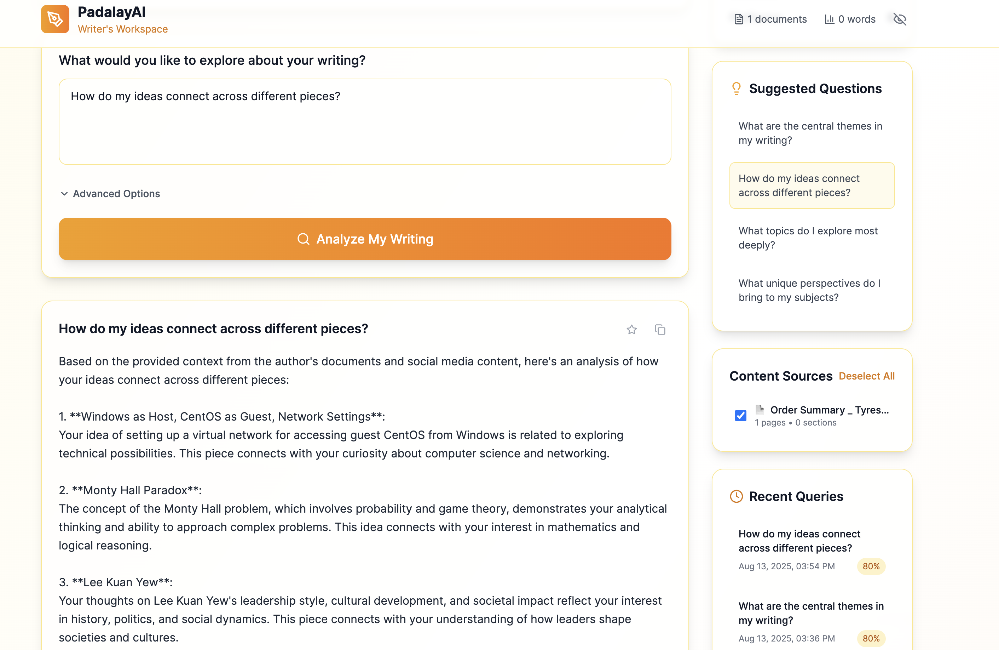

# PadalayAI - Your AI Author's Assistant

PadalayAI is your personal AI author's assistant, using Large Language Models (LLMs) with Retrieval-Augmented Generation (RAG) to help you actively improve your drafts. Go beyond simple analysis and receive targeted feedback, refine your writing style, and get actionable suggestions to strengthen your arguments and narrative.

## Features

### 🧠 AI-Powered Analysis
- **RAG Implementation**: Uses retrieval-augmented generation for accurate, context-aware responses
- **OpenAI Integration**: Leverages GPT models for high-quality text generation and embeddings
- **Fallback Mode**: Works without OpenAI API key using basic text processing

### 📄 Document Management
- **Multi-format Support**: PDF, DOCX, TXT, and Markdown files
- **Smart Processing**: Automatic text extraction and chunking
- **Metadata Extraction**: File statistics, reading time, language detection

### 🔍 Intelligent Querying
- **Natural Language Questions**: Ask questions in plain English
- **Document Selection**: Query specific documents or entire collection
- **Advanced Options**: Adjustable temperature, result limits, and more
- **Source Attribution**: See exactly which document sections informed each answer

### 📊 Analytics & History
- **Query History**: Track all your questions and answers
- **Export Functionality**: Export results in multiple formats
- **Performance Metrics**: Confidence scores, processing times, and more
- **Search & Filter**: Find past queries quickly

### 🎨 Modern Interface
- **Responsive Design**: Works on desktop, tablet, and mobile
- **Intuitive Navigation**: Clean, professional interface
- **Real-time Updates**: Live progress indicators and notifications
- **Dark Mode Ready**: Prepared for theme switching

## Architecture

### System Overview

```
┌─────────────────────────────────────────────────────────────────────────────┐
│                              PadalayAI Architecture                         │
└─────────────────────────────────────────────────────────────────────────────┘

┌─────────────────┐    HTTP/REST API    ┌─────────────────────────────────────┐
│                 │◄──────────────────►│                                     │
│   React Frontend│                    │           Express Backend           │
│                 │                    │                                     │
│  ┌─────────────┐│                    │  ┌─────────────┐ ┌─────────────────┐│
│  │WriterWorksp ││                    │  │   Routes    │ │   Middleware    ││
│  │Documents    ││                    │  │             │ │                 ││
│  │History      ││                    │  │ documents.js│ │ validation.js   ││
│  │Settings     ││                    │  │ queries.js  │ │ cors, helmet    ││
│  └─────────────┘│                    │  │digitalPers. │ │ rate limiting   ││
│                 │                    │  └─────────────┘ └─────────────────┘│
│  ┌─────────────┐│                    │           │                         │
│  │   API       ││                    │           ▼                         │
│  │  Service    ││                    │  ┌─────────────────────────────────┐│
│  └─────────────┘│                    │  │           Services              ││
└─────────────────┘                    │  │                                 ││
                                       │  │ ┌─────────────┐ ┌─────────────┐ ││
                                       │  │ │DocumentProc │ │ RAGService  │ ││
                                       │  │ │             │ │             │ ││
                                       │  │ │ PDF Parse   │ │ Embeddings  │ ││
                                       │  │ │ Text Chunk  │ │ Vector Search│ ││
                                       │  │ └─────────────┘ └─────────────┘ ││
                                       │  │                                 ││
                                       │  │ ┌─────────────┐ ┌─────────────┐ ││
                                       │  │ │DigitalPers. │ │ MCP Client  │ ││
                                       │  │ │ Service     │ │             │ ││
                                       │  │ │ Social Sync │ │ Blogger API │ ││
                                       │  │ │ Analysis    │ │ Facebook    │ ││
                                       │  │ └─────────────┘ │ Instagram   │ ││
                                       │  │                 └─────────────┘ ││
                                       │  └─────────────────────────────────┘│
                                       └─────────────────────────────────────┘
                                                        │
                                                        ▼
┌─────────────────────────────────────────────────────────────────────────────┐
│                              External Services                              │
├─────────────────────────────────────────────────────────────────────────────┤
│                                                                             │
│  ┌─────────────────┐    ┌─────────────────┐    ┌─────────────────────────┐  │
│  │   ChromaDB      │    │   OpenAI API    │    │    File System          │  │
│  │                 │    │                 │    │                         │  │
│  │ Vector Storage  │    │ GPT Models      │    │ ┌─────────────────────┐ │  │
│  │ Embeddings      │    │ Embeddings      │    │ │ uploads/documents/  │ │  │
│  │ Similarity      │    │ Completions     │    │ │ data/documents.json │ │  │
│  │ Search          │    │                 │    │ │ data/query_history  │ │  │
│  │                 │    │                 │    │ │ logs/               │ │  │
│  │ ┌─────────────┐ │    │ ┌─────────────┐ │    │ └─────────────────────┘ │  │
│  │ │ Fallback:   │ │    │ │ Fallback:   │ │    │                         │  │
│  │ │ In-Memory   │ │    │ │ Simple TF-  │ │    │                         │  │
│  │ │ Vector Store│ │    │ │ IDF Embed   │ │    │                         │  │
│  │ └─────────────┘ │    │ └─────────────┘ │    │                         │  │
│  └─────────────────┘    └─────────────────┘    └─────────────────────────┘  │
│                                                                             │
│  ┌─────────────────────────────────────────────────────────────────────┐   │
│  │                        MCP Servers                                  │   │
│  │                                                                     │   │
│  │  ┌─────────────┐  ┌─────────────┐  ┌─────────────┐                 │   │
│  │  │ Blogger     │  │ Facebook    │  │ Instagram   │                 │   │
│  │  │ Server      │  │ Server      │  │ Server      │                 │   │
│  │  │             │  │             │  │             │                 │   │
│  │  │ Blog Posts  │  │ Posts       │  │ Posts       │                 │   │
│  │  │ Comments    │  │ Comments    │  │ Stories     │                 │   │
│  │  │ Analytics   │  │ Analytics   │  │ Analytics   │                 │   │
│  │  └─────────────┘  └─────────────┘  └─────────────┘                 │   │
│  └─────────────────────────────────────────────────────────────────────┘   │
└─────────────────────────────────────────────────────────────────────────────┘

                                Data Flow
                               ═══════════

1. User uploads document OR syncs social media content → Document Processing
2. Text Extraction & Chunking → Embedding Generation → Vector Storage
3. User submits query → Enhanced with Digital Persona analysis
4. Query Embedding → Similarity Search → Context Retrieval from all sources
5. Context + Query → LLM Processing → Generated Answer → Response to User
6. All interactions logged → Query History → Persistent Storage
7. Social media sync → MCP Servers → Platform APIs → Content ingestion

                              Key Features
                             ═══════════════

• Multi-Source Analysis: Documents + Social Media content (Blogger, Facebook, Instagram)
• Digital Persona: AI-powered writing style and voice analysis across platforms
• MCP Integration: Modular server architecture for platform-specific APIs
• Graceful Degradation: Falls back to in-memory storage if ChromaDB unavailable
• Error Recovery: Automatic ChromaDB reconnection and fallback mechanisms  
• Upload Safety: Nodemon ignores upload directories to prevent server restarts
• Robust Processing: Handles PDF, DOCX, TXT, MD with comprehensive error handling
```



### Backend (Node.js/Express)
```
backend/
├── src/
│   ├── server.js                 # Main server entry point
│   ├── routes/                   # API route handlers
│   │   ├── documents.js          # Document upload/management
│   │   ├── queries.js            # Query processing
│   │   └── digitalPersona.js     # Digital persona & social sync
│   ├── services/                 # Business logic
│   │   ├── documentProcessor.js  # Document parsing & chunking
│   │   ├── ragService.js         # RAG implementation
│   │   ├── vectorStore.js        # Vector storage (in-memory)
│   │   ├── digitalPersonaService.js # Social media integration
│   │   ├── mcpClient.js          # MCP server management
│   │   └── index.js              # Service orchestration
│   └── middleware/               # Express middleware
│       └── validation.js         # Request validation
├── package.json
└── .env.example
```

### Frontend (React/Vite)
```
frontend/
├── src/
│   ├── components/            # Reusable UI components
│   │   └── Layout.jsx         # Main layout wrapper
│   ├── pages/                 # Page components
│   │   ├── WriterWorkspace.jsx # Main workspace (home page)
│   │   ├── Documents.jsx      # Document management
│   │   ├── History.jsx        # Query history
│   │   └── Settings.jsx       # Configuration
│   ├── services/              # API communication
│   │   └── api.js             # HTTP client & utilities
│   ├── App.jsx                # Main app component
│   ├── main.jsx               # React entry point
│   └── index.css              # Global styles
├── package.json
├── vite.config.js
├── tailwind.config.js
└── postcss.config.js
```

## Installation & Setup

### Prerequisites
- Node.js 18+ and npm
- OpenAI API key (optional, for full functionality)
- Chroma

### Backend Setup

1. **Navigate to backend directory:**
   ```bash
   cd backend
   ```

2. **Install dependencies:**
   ```bash
   npm install
   ```

3. **Configure environment:**
   ```bash
   cp .env.example .env
   # Edit .env with your settings
   
   ```

4. **Start ChromaDB (Optional - will fallback to in-memory storage if not available)**
   ```bash
   # Option 1: Use the setup script
   chmod +x setup-chromadb.sh
   ./setup-chromadb.sh
   
   # Option 2: Manual setup
   pip install chromadb
   chroma run --host localhost --port 8001
   ```

5. **Start the server:**
   ```bash
   # Option 1: Use the restart script (recommended)
   chmod +x restart-server.sh
   ./restart-server.sh
   
   # Option 2: Manual start with upload-safe configuration
   npm run dev:watch
   
   # Option 3: Standard development mode
   npm run dev
   ```

   The backend will be available at `http://localhost:8000`

### Frontend Setup

1. **Navigate to frontend directory:**
   ```bash
   cd frontend
   ```

2. **Install dependencies:**
   ```bash
   npm install
   ```

3. **Start the development server:**
   ```bash
   npm run dev
   ```

   The frontend will be available at `http://localhost:3000`

## Configuration

### Environment Variables (.env)

```bash
# Server Configuration
PORT=8000
NODE_ENV=development
FRONTEND_URL=http://localhost:3000

# OpenAI Configuration (Required for full LLM features)
OPENAI_API_KEY=your_openai_api_key_here
OPENAI_BASE_URL=your_openai_api_base_url

# File Upload Configuration
MAX_FILE_SIZE=52428800  # 50MB
UPLOAD_DIR=uploads/documents

# Rate Limiting
RATE_LIMIT_WINDOW_MS=900000    # 15 minutes
RATE_LIMIT_MAX_REQUESTS=100    # Max requests per window

# Security
CORS_ORIGIN=http://localhost:3000
```

### OpenAI API Key Setup

1. **Get an API key** from [OpenAI Platform](https://platform.openai.com/api-keys)
2. **Add to .env file:**
   ```bash
   OPENAI_API_KEY=sk-your-actual-api-key-here
   ```
3. **Restart the backend server**

**Note:** Without an OpenAI API key, the system will use a fallback mode with basic text processing and similarity matching.

## Usage Guide

### 1. Writer's Workspace (Main Interface)
- The **Writer's Workspace** is your main hub for AI-powered writing analysis
- Choose your analysis focus: Content & Themes, Writing Style, Author Voice, or Genre & Form
- Select documents or sync social media content to analyze
- Ask questions about your writing in natural language
- Get AI-powered insights with source attribution and confidence scores

### 2. Upload Documents
- Navigate to the **Documents** page or use the upload section in the workspace
- Drag & drop files or click to select
- Supported formats: PDF, DOCX, TXT, MD
- Maximum file size: 50MB per file

### 3. Social Media Integration
- Sync content from Blogger, Facebook, and Instagram
- Use the sync button in the workspace sidebar
- Analyze your writing across all platforms for consistent voice and style

### 4. Review History
- Visit the **History** page to see all past queries
- Search through previous questions and answers
- Export results for external use
- Expand entries to see source citations

### 5. Configure Settings
- Access the **Settings** page for customization
- Adjust AI parameters (temperature, max results)
- Monitor system health and status
- View usage guidelines and tips

## API Endpoints

### Documents
- `POST /api/documents/upload` - Upload a document
- `GET /api/documents` - List all documents
- `GET /api/documents/:id` - Get specific document
- `DELETE /api/documents/:id` - Delete document
- `GET /api/documents/stats/overview` - Get document statistics

### Queries
- `POST /api/queries` - Submit a query
- `GET /api/queries/history` - Get query history
- `GET /api/queries/:id` - Get specific query result
- `POST /api/queries/search` - Semantic search
- `POST /api/queries/export` - Export query results
- `DELETE /api/queries/history` - Clear query history

### Digital Persona
- `POST /api/digital-persona/query` - Enhanced query with digital persona analysis
- `POST /api/digital-persona/sync` - Sync social media content
- `GET /api/digital-persona/sync-status` - Get sync status for all platforms
- `GET /api/digital-persona/stats` - Get digital persona statistics

### Health
- `GET /health` - Basic health check
- `GET /api/status` - Detailed system status

## Development

### Utility Scripts

The project includes several utility scripts to help with common tasks:

- **`./restart-server.sh`** - Safely restart the backend server with upload-safe configuration
- **`./setup-chromadb.sh`** - Install and start ChromaDB vector database
- **`./reset-chromadb.sh`** - Clean corrupted ChromaDB database and reset to fresh state

### Backend Development
```bash
cd backend
npm run dev        # Start with nodemon
npm run dev:watch  # Start with upload-safe nodemon config (recommended)
npm run start      # Production start
npm run lint       # Run ESLint
```

### Frontend Development
```bash
cd frontend
npm run dev        # Start Vite dev server
npm run build      # Build for production
npm run preview    # Preview production build
npm run lint       # Run ESLint
```

### Project Structure Best Practices
- **Modular Architecture**: Separate concerns between routes, services, and middleware
- **Error Handling**: Comprehensive error handling with proper HTTP status codes
- **Validation**: Input validation using Joi schemas
- **Logging**: Structured logging with Winston
- **Security**: CORS, rate limiting, and input sanitization

## Deployment

### Production Build

1. **Build frontend:**
   ```bash
   cd frontend
   npm run build
   ```

2. **Configure production environment:**
   ```bash
   cd backend
   cp .env.example .env.production
   # Update with production values
   ```

3. **Start production server:**
   ```bash
   cd backend
   NODE_ENV=production npm start
   ```

### Docker Deployment (Optional)

Create `Dockerfile` for containerized deployment:

```dockerfile
# Backend Dockerfile
FROM node:18-alpine
WORKDIR /app
COPY package*.json ./
RUN npm ci --only=production
COPY . .
EXPOSE 8000
CMD ["npm", "start"]
```

## Troubleshooting

### Common Issues

1. **"Network Error" during file uploads**
   - **Cause**: Server restarting due to file change detection
   - **Solution**: Use `npm run dev:watch` or `./restart-server.sh` which ignores upload directories
   - **Prevention**: The `nodemon.json` configuration prevents server restarts on file uploads

2. **"ChromaDB compaction error"**
   - **Cause**: Corrupted ChromaDB database
   - **Solution**: Run `./reset-chromadb.sh` to clean the database
   - **Fallback**: System automatically falls back to in-memory storage

3. **"Cannot connect to server"**
   - Ensure backend is running on port 8000
   - Check CORS configuration
   - Verify frontend proxy settings

4. **"OpenAI API errors"**
   - Verify API key is correct and active
   - Check API usage limits and billing
   - Ensure proper environment variable setup

5. **"File upload fails"**
   - Check file size (max 50MB)
   - Verify file format is supported
   - Ensure upload directory exists and is writable

6. **"Poor query results"**
   - Try more specific questions
   - Adjust temperature settings
   - Ensure documents are properly processed
   - Check document content quality

7. **"Zero chunks showing for uploaded documents"**
   - Check if document processing completed successfully
   - Verify PDF/DOCX files contain extractable text
   - Refresh the frontend to clear cached data

### Performance Optimization

- **Document Processing**: Large documents are automatically chunked for better performance
- **Caching**: Query results are cached to improve response times
- **Rate Limiting**: Prevents API abuse and ensures fair usage
- **Memory Management**: In-memory vector store is optimized for development use

## Contributing

1. Fork the repository
2. Create a feature branch (`git checkout -b feature/amazing-feature`)
3. Commit your changes (`git commit -m 'Add amazing feature'`)
4. Push to the branch (`git push origin feature/amazing-feature`)
5. Open a Pull Request

## License

This project is licensed under the MIT License - see the [LICENSE](LICENSE) file for details.

## Support

For support, questions, or feature requests:
- Create an issue on GitHub
- Check the troubleshooting section above
- Review the API documentation

## Acknowledgments

- **OpenAI** for providing the GPT models and embeddings API
- **React** and **Vite** for the modern frontend framework
- **Express.js** for the robust backend framework
- **Tailwind CSS** for the beautiful, responsive design system

---

**PadalayAI** - Empowering authors with AI-driven document analysis and insights.
